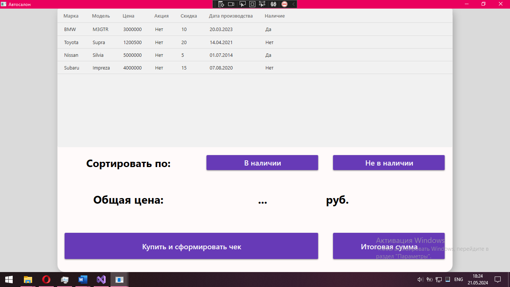
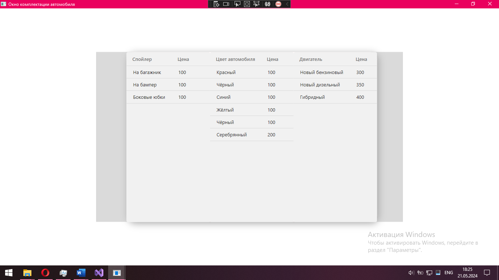

<h1 style="text-align:center;">CarDealership</h1>
<h2 style="text-align:center;">“Автосалон”</h2>

<h3>Описание:</h3>

  Данный проект представляет из себя подобие автосалона в котором пользователь может:

<ul>
  <li>Выбрать автомобиль</li>
  <li>Сортировать автомобили в таблице по налию не наличию</li>
  <li>Выбрать дополнительные комплектующие</li>
  <li>Узнать общую цену своего заказа</li>
  <li>Оформить заказ</li>
  <li>Сформировать чек</li>
  <li>Просмотреть содержимое чека в специальном файле</li>
  <li>Просмотреть историю своих действий в специальном файле</li>
</ul>

<h3>В ходе создания проекта применялись такие технологии как:</h3>
<ul>
  <li>Язык программирования C#</li>
  <li>Среда разработки Visual Studio</li>
  <li>СУБД SQL Server Management Studio (SSMS)</li>
  <li>Язык разметки XAML</li>
  <li>Библиотека Material Design</li>
  <li>Собственная библиотека CarDealershipLibrary.dll (Лежит в папке DLLS)</li>
  <li>Собственная библиотека MultiWindowInterfaceLibary.dll (Лежит в папке DLLS)</li>
  <li>Собственная библиотека LogLibary.dll (Лежит в папке DLLS)</li>
</ul>

<h3>Скриншоты проекта:</h3>
<figure>
	
	
Рисунок 1 - главное окно

</figure>
<figure>
	
	
Рисунок 2 - дополнительное окно

</figure>

<h3>Видео демонстрация:</h3>

https://github.com/NecroDieMon/CarDealership/assets/116455805/38ddad36-23ce-46f1-a851-933ff97502d1

